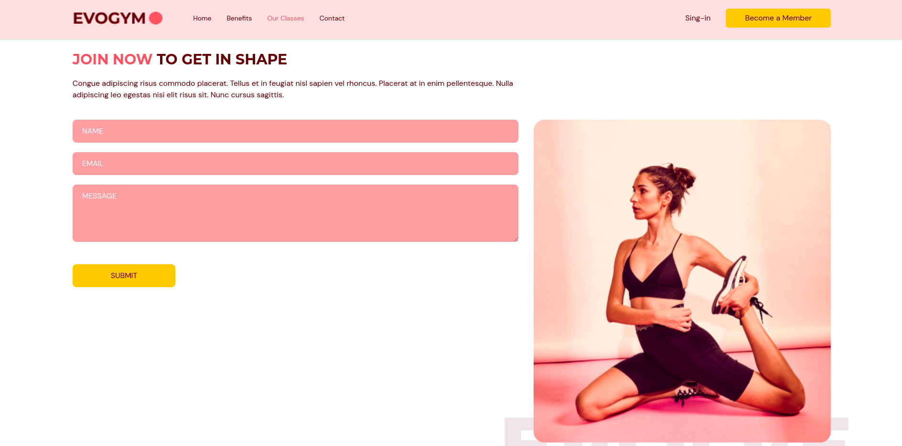

# Gym-App-Project

O Gym-App-Project é uma aplicação web fictícia de uma academia, construída com React e ReactDOM para oferecer uma experiência responsiva. Com animações suaves do framer-motion e a gestão eficiente de formulários do react-hook-form, o site proporciona uma navegação dinâmica. A estilização é facilitada pelo tailwindcss, enriquecendo o layout com ícones do @heroicons/react e possibilitando um deslocamento suave através do react-anchor-link-smooth-scroll. Utilizando TypeScript e Vite para gerenciamento, o projeto é uma plataforma moderna para praticar desenvolvimento web.





## Demonstração
https://gym-app-project-six.vercel.app

Veja uma demonstração ao vivo aqui

## Instalação
1.Certifique-se de ter o Node.js instalado.
2.Clone este repositório para o seu ambiente local usando:
```bash
git clone https://github.com/VinicinBraga/Gym-App-Project.git
```

3.Acesse o diretório do projeto:
```bash
cd E-commerce-App
```
4.Instale as dependências do projeto:
```bash
npm install
```

## Como usar
npm run dev

## Contribuição
Contribuições são bem-vindas! Se você encontrar bugs, problemas ou tiver melhorias a serem sugeridas, abra uma issue ou envie uma solicitação de pull.

## Licença
Este projeto está licenciado sob a MIT License.

## Contato
Se você tiver alguma dúvida ou precisar entrar em contato, pode me encontrar em:

Email: vinicius@bragamatta.com ou vinibm85@gmail.com

GitHub: https://github.com/VinicinBraga

Linkedin: https://www.linkedin.com/in/vinícius-braga
